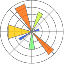

# Hi there, I'm Vivek - aka [vivekkumar2021] 👋 

## I'm a Data Scientist, MLOps Engineer and Teacher!!

- 🌱 I’m addicted to learning and growing everyday
- 👯 I’m currently sharing a little bit of my knowledge to the world through my blogs
- 🥅 2022 Goals: Learn more about Responsible AI
- ⚡ Fun fact: I'm a traveller and currently learning to play guitar
- 😻 I love programming, data science, FPS games and cars

### Connect with me:

&nbsp;&nbsp;

&nbsp;&nbsp;

### Languages and Tools:

 
 

  
:zap: GitHub Stats

  

[website]: http://predictionoid.herokuapp.com/
[linkedin]: https://www.linkedin.com/in/vivek-kumar-76457193/

